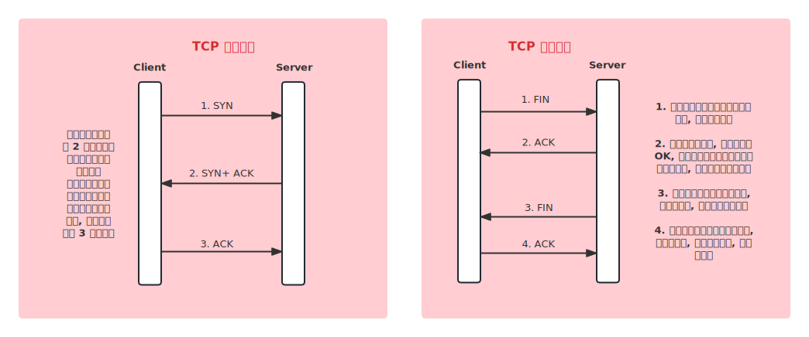
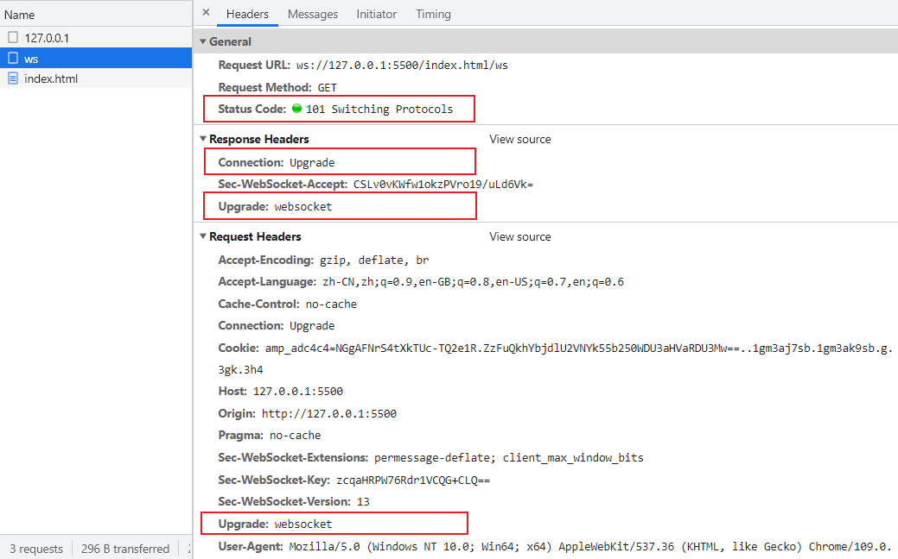

# 综合强化

[[toc]]

## 从输入 URL 到渲染出页面的整个过程?

:::tip 答案

加载资源:

1. 浏览器判断 URL 是否符合规范, 再进行 URL 编码
2. DNS 解析 : 域名 -> IP 地址
3. 浏览器根据 IP 地址向服务器发起 HTTP 请求
4. 服务器处理 HTTP 请求, 并返回给浏览器

渲染过程:

1. 根据 HTML 代码生成 DOM Tree
2. 根据 CSS 代码生成 CSSOM (具体看 CSS 书写位置, 建议放上面先渲染 CSSOM)
3. 将 DOM Tree 和 CSSOM 整合形成 Render Tree
4. 根据 Render Tree 渲染页面
5. 遇到 &lt;script&gt; 则暂停渲染, 优先加载并执行 JS 代码, 完成再继续
6. 直至把 Render Tree 渲染完成

:::

## 性能优化方案?

:::info 前情提要

性能优化原则: (适用于所有编程的性能优化 —— 空间换时间)

- 多使用内存、缓存或其它方法
- 减少 CPU 计算量, 减少网络加载耗时

:::

:::tip 答案

- 让加载更快
  - 减少资源体积: 压缩代码、Tree Shaking
  - 升级 HTTP/2.0, 合并代码并进行合理的 Code Spliting
  - 一些小图片可以 base64 直接嵌入, 减少请求
  - 使用 CDN 加速
- 让渲染更快
  - CSS 放在 head 里, JS 放 body 最下面, 或合理使用 defer 与 async (先执行 CSS, 最后执行 JS)
  - 对静态资源进行缓存
  - 图片懒加载, 上滑加载更多
  - 对 DOM 查询进行缓存
  - 需要频繁操作 DOM 时, 合并到一起插入 DOM 结构
  - 节流 throttle 防抖 debounce

:::

## 请描述一下 TCP 的三次握手和四次挥手?

:::info 前情提要
为什么 TCP 需要进行三次握手? 确保双方都有收发消息的能力。
:::



:::tip 答案

TCP 三次握手:

- Client 发包, Server 接收 (Server: 有 Client 找我)
- Server 发包, Client 接收 (Client: Server 已经收到信息了)
- Client 发包, Server 接收 (Server: Client 要准备发送了)

TCP 四次挥手:

- Client 发包, Server 接收 (Server: Client 已请求结束)
- Server 发包, Client 接收 (Client: Server 已收到, 我等待它关闭)
- Server 发包, Client 接收 (Client: Server 此时可以关闭连接了)
- Client 发包, Server 接收 (Server: 可以关闭了)

:::

## HTTP 跨域请求时为何发送 options 请求

:::tip 答案

- options 请求, 是跨域请求之前的预检查, 旨在查询 server 端支持哪些请求方法等
- 它是浏览器自行发起的, 无需我们干预, 不会影响实际的功能

:::

## WebSocket 和 HTTP 协议有什么区别?

:::info 前置知识
WebSocket:

- 支持端对端通讯
- 可以由 client 发起, 也可以由 server 发起
- 用于消息通知、直播间讨论区、聊天室、协同编辑

WebSocket 连接过程:

- 先发起一个 HTTP 请求
- 成功之后再升级到 WebSocket 协议, 再通讯

:::

:::code-group

```js [客户端]
const ws = new WebSocket('ws://127.0.0.1:3000')
ws.onopen = () => {
  console.log('opend')
  ws.send('client opend')
}
ws.onmessage = (event) => {
  console.log('收到了信息: ', event.data)
}
```

```js [服务端]
const { WebSocketServer } = require('ws')

const wsServer = new WebSocketServer({ port: 3000 })

wsServer.on('connection', (ws) => {
  console.log('connected')

  ws.on('message', (msg) => {
    console.log('收到了信息', msg.toString())

    setTimeout(() => {
      ws.send('服务端收到了信息' + msg.toString())
    }, 2000)
  })
})
```

:::



:::tip 答案

- WebSocket 协议名是 ws:// , 可双端发起请求
- WebSocket 没有跨域限制
- 通过 send 和 onmessage 通讯(HTTP 通过 req 和 res)

:::

:::info 拓展

- ws 可升级为 wss(像 https)
- 实际项目推荐使用 socket.io, API 更简洁

:::

## WebSocket 和 HTTP 长轮询的区别?

:::tip 答案

- WebSocket 是双端通信
- 而 HTTP 长轮询本质还是从客户端发出消息, 只不过处理 timeout, 超时之后重新发起请求(轮询)

:::

## 网页重绘 repaint 和重排 reflow 有什么区别?

:::tip 答案

- 重绘
  - 元素外观改变, 如颜色、背景色
  - 但元素的尺寸、定位不变, 不会影响其它元素的位置
- 重排
  - 重新计算尺寸和布局, 可能会影响其它元素的位置
  - 如元素高度增加, 可能使相邻元素位置下移

重排比重绘的影响更大, 消耗也更大。所以, 要尽量避免无意义的重排。

:::

:::info 减少重排的方法

- 集中修改样式, 或直接切换 css, class
- 修改之前先设置 display: none, 脱离文档流
- 使用 BFC 特性, 不影响其它元素位置
- 频繁触发(resize, scroll) 使用节流和防抖
- 使用 createDocumentFragment 批量操作 DOM
- 优化动画, 使用 CSS3 和 requestAnimationFrame

:::

## 如何实现网页多标签 tab 通讯?

:::tip 答案

1. 使用 WebSocket
   - 无跨域限制
   - 需要服务端支持, 成本高
2. 使用 localStorage 通讯 (推荐)
   - 同域的 A B 两个页面
   - A 页面设置 localStorage
   - B 页面可监听到 localStorage 值的修改
3. 通过 shareWorker 通讯 (调式不方便, 不兼容 IE)
   - ShareWorker 是 WebWorker 的一种
   - WebWorker 可开启子进程执行 JS, 但不能操作 DOM
   - ShareWorker 可单独开启一个进程, 用于同域页面通讯

:::

## 如何实现网页和 iframe 之间的通讯?

:::tip 答案

- 使用 postMessage 通讯
- 注意跨域的限制和判断

:::

## H5 页面如何进行首屏优化?

:::info 前置知识

- 路由懒加载
  - 只适用于 SPA
  - 路由拆分, 优先保证首页加载
- 服务端渲染 SSR
  - 传统的前后端分离(SPA)渲染页面的过程复杂
  - SSR 渲染页面过程简单, 性能好
  - 如果是纯 H5 页面, SSR 是性能优化的终极方案
- 分页
  - 针对列表页, 默认只展示第一页内容
  - 上划加载更多
- 图片懒加载
  - 注意提前设置图片尺寸, 尽量只重绘不重排
- APP 预取
  - 如果 H5 在 App WebView 中展示, 可使用 App 预取
  - 用户访问列表页时, App 预加载文章首屏内容
  - 用户进入 H5 页, 直接从 App 中获取内容, 瞬间展示首屏
- Hybird
  - 提前将 HTML、JS、CSS 下载到 APP 内部
  - 在 App WebView 中使用 file:// 协议加载页面文件
  - 再用 Ajax 获取内容并展示

:::

:::tip 答案

- 路由懒加载
- 服务端渲染 SSR
- 分页
- 图片懒加载
- APP 预取
- Hybird

服务端 SSR 是 H5 的终极优化方案(但成本也高), 移动端 H5 要结合 APP 能力去优化。

:::
