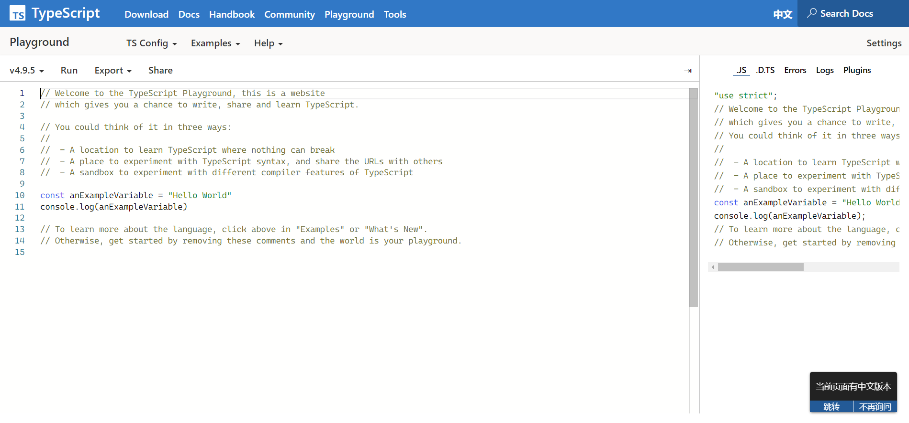

# 环境配置

`.ts` 文件是不可以直接执行的, 需要编译为 `.js` 文件, 才能够进行运行。

## tsc 的安装与使用

tsc 是 typescript compiler 的缩写, 即为 TS 的编译器。它是 `typescript` 包自带的命令行工具。

```shell
# npm 全局安装 typescript
npm install typescript -g
```

> typescript 可以全局安装也可以只为项目安装, 建议全局也安装一下。

现在, 可以尝试输入如下指令来检查 TS 环境的工作情况。

```shell
# 检查是否存在 tsc 环境变量, 打印其版本信息
tsc -v

# 打印 tsc 的帮助信息
tsc -h
```

下面是 `tsc -h` 的部分输出信息(不全, 可自行打印)。

```text{5,8,15,24}
tsc: The TypeScript Compiler - Version 4.8.4

COMMON COMMANDS

  tsc
  Compiles the current project (tsconfig.json in the working directory.)

  tsc app.ts util.ts
  Ignoring tsconfig.json!
  compiles the specified files with default compiler options.

  tsc -b
  Build a composite project in the working directory.

  tsc --init
  Creates a tsconfig.json with the recommended settings in the working directory.

  tsc -p ./path/to/tsconfig.json
  Compiles the TypeScript project located at the specified path.

  tsc --help --all
  An expanded version of this information, showing all possible compiler options

  tsc --noEmit
  tsc --target esnext
  Compiles the current project, with additional settings.

You can learn about all of the compiler options at https://aka.ms/tsc
```

所以想要编译以及运行某个 ts 文件只需要进行以下操作。

```shell
# 将 ts 文件编译为 js 文件
tsc demo.ts

# 运行 js 文件
node demo.js
```

## ts-node

tsc 的使用每次都需要两步, 先将 ts 文件编译为 js 文件, 再执行 js 文件。

在 node.js 环境下, 可利用 `ts-node` 合并以上操作。

```shell
# 全局安装 ts-node
npm install ts-node -g

# 直接运行
ts-node demo.ts
```

## 线上环境

官网的 [Playground](https://www.typescriptlang.org/play) 可用于线上编写 TS 代码, 适用于编写一些 demo。


