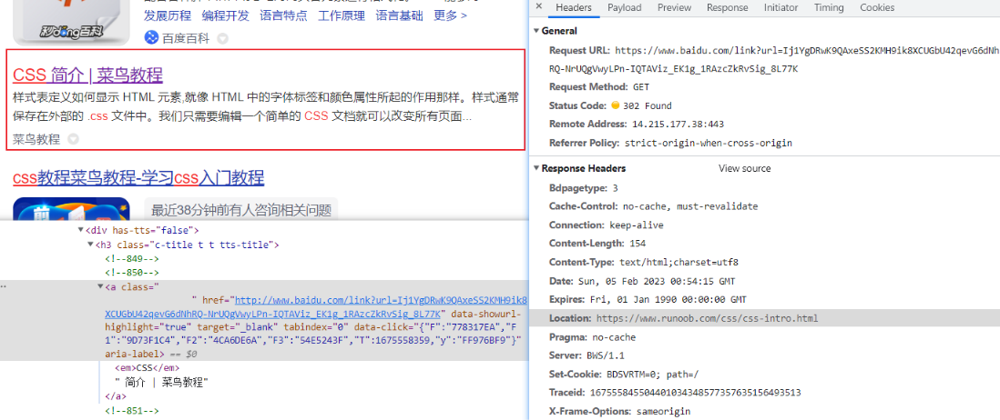

# HTTP 基础

## 状态码

### 状态码分类

- 1xx : 服务器收到请求
- 2xx : 请求成功, 如 200
- 3xx : 重定向, 如 302
- 4xx : 客户端错误
- 5xx : 服务端错误

### 常见状态码

- 200 : 成功
- 301 : 永久重定向(配合 Location 响应头, 浏览器自动处理)
- 302 : 临时重定向(配合 Location 响应头, 浏览器自动处理)
- 304 : 资源未修改, 协商缓存
- 404 : 资源未找到
- 403 : 没有权限
- 500 : 服务器错误
- 504 : 网关超时

像百度一下搜索的跳转就是 302 临时重定向, 首先还是跳百度的地址, 返回状态码 302, 然后 Location 响应头是目标地址, 浏览器就会自动跳转。

## 请求方法

- get : 获取数据
- post : 新建数据
- put : 更新数据
- patch : 更新数据(部分更新)
- delete : 删除数据

接口设计应该遵从 [RESTful API](https://restfulapi.cn/) 规范。

## 头部信息

### 请求头

- Accept : 浏览器可接受的数据格式
- Accept-Encoding : 浏览器可接收的压缩算法, 如 gzip
- Accept-Language : 浏览器可接收的语言, 如 zh-CN
- Content-Type : 发送的数据格式, 如 application/json
- Connection : keep-alive 一次 TCP 连接重复使用
- cookie : 默认同源请求会带上 cookie
- User-Agent : 简称 UA, 浏览器信息

### 响应头

- Content-Type : 返回的数据格式, 如 application/json
- Content-Length : 返回数据的大小, 字节为单位
- Content-Encoding : 返回数据的压缩算法, 如 gzip
- Set-Cookie : 服务端设置 Cookie

## HTTP 协议的瓶颈

- 一条连接上只可发送一个请求
- 请求只能从客户端开始, 客户端不可以接受除响应以外的指令
- 请求/响应头部不经压缩就发送
- 每次互相发送相同的头部造成的浪费较多
- 非强制压缩发送
