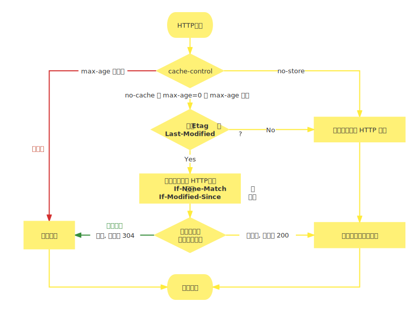

# HTTP 缓存

HTTP 缓存一般指的是为了性能优化在**浏览器端**缓存一些静态文件, 例如 css、js、image 等。<f>HTML 文件一般不作缓存。</f>

## 缓存相关的首部字段

### Expires

Expires 响应头用于控制缓存过期时间, 它是 HTTP/1.0 时代的产物, 后被 Cache-Control 通用首部字段替代。

```text
Expires: Sun Feb 05 2023 17:05:35 GMT
```

<f>由于 Expires 采取的是"绝对时间", 而服务器与浏览器的时间很有可能不一致, 所以它的判断并不是很准确。</f>

### Cache-Control

Cache-Control 是通用首部字段, 它是 HTTP/1.1 时代的产物。

> 当请求头设置了此字段时, 以请求头的为准, 但是请求头一般不包含此字段。

它的常用指令如下:

- max-age<Badge type="tip" text="必需参数" /> : 响应的有效时长
- no-cache<Badge type="tip" text="默认参数" /> : 获取资源前向服务器验证缓存是否可用
- no-store : 不缓存任何内容
- public : 任意方都可缓存, 如代理
- private<Badge type="tip" text="默认参数" /> : 只允许用户做缓存, 不允许代理做缓存

<f>max-age 可以说是 Expires 的替代产物, 它采取的是有效时长(时间的偏移量)。</f>

```text
Cache-Control: private, max-age=3600 (单位为秒)
```

:::info 补充

- max-age 为必需参数是指如果需要缓存必须设置此字段, 例如协商缓存也要设置 max-age=0
- no-cache 默认参数是指默认就是 no-cache, 如 `max-age=100` 与 `max-age=100, no-cache` 等价

:::

## 资源标识相关的首部字段

资源标识相关的首部字段用于判断资源是否过期。

### Last-Modified 与 If-Modified-Since

Last-Modified 响应头表示资源最后修改时间, 但<f>只能精确到秒级</f>, 所以并不能保证百分百准确。

```text
Last-Modified: Sun Feb 05 2023 17:05:35 GMT
```

If-Modified-Since 请求头就是上一次资源响应的 Last-Modified, 服务器获取此字段判断资源是否过期, 如果没有过期返回 304 状态码, 通知浏览器使用缓存即可, 否则, 返回最新资源与最新资源标识。

```text
If-Modified-Since: Sun Feb 05 2023 17:05:35 GMT
```

### Etag 与 If-None-Match

由于 Last-Modified 并不能保证百分百准确, 所以 HTTP 协议增加了 Etag 字段作为资源的唯一标识。

<f>Etag 响应头有点像资源内容的哈希, 它是一个字符串, 只有资源内容发生改变时才会发生变化。</f>

```text
Etag: 'usagi-1234'
```

If-None-Match 请求头就是上一次资源响应的 Etag, 服务器获取此字段判断资源 Etag 是否相同, 不一致才会将新资源返回给浏览器, 否则, 返回 304 状态码, 通知浏览器使用缓存即可。

```text
If-None-Match: 'usagi-1234'
```

:::tip
Etag 优先级比 Last-Modified 高。
:::

## 强缓存与协商缓存

<f>首先, 不管是强缓存还是协商缓存 Cache-Control 的值都不包含 no-store。</f>**以下默认此条件**。

当 Cache-Control 值为 no-store 时, 浏览器会直接发起请求, 且不携带任何资源标识首部字段, 对返回资源也不进行缓存。

### 强缓存

当 Cache-Control 的 max-age 值未过期时会触发强缓存, 浏览器直接读取缓存不请求接口。

:::warning 注意
Cache-Control 的 max-age 值过期时, 浏览器请求仍然会携带 Etag、Last-Modified 资源标识, 此时就变成了协商缓存。当资源未改变时返回 304 状态码并更新 max-age 值, 否则, 返回新的资源。
:::

### 协商缓存

协商缓存的意思就是浏览器与服务器共同判断资源是否可用, 常用的做法是将 max-age=0。

这样一来浏览器每次想使用缓存时都会发送一个携带资源标识的请求给浏览器。 如果资源可用, 服务器返回 304 状态码, 否则返回新的资源与资源标识。

## 不同刷新操作, 不同缓存策略

- 正常操作 : 强制缓存有效, 协商缓存有效
- 手动刷新 : 强制缓存失效, 协商缓存有效
- 强制刷新 : 强制缓存失效, 协商缓存失效

:::tip
所谓的协商缓存失效实际就是发送请求时不携带资源标识头部信息而已。
:::



## 缓存改进方案

<f>浏览器是无法跳过缓存过期时间主动感知文件变化的。</f>换句话说, 在缓存没有过期时, 哪怕服务器的资源发生了变化, 浏览器仍会使用缓存文件。

### md5/hash 缓存

通过不缓存 HTML 文件, 为静态文件名称(css、js、image)添加 MD5 或 hash 标识, 解决浏览器无法跳过缓存过期时间主动感知文件变化的问题。

:::tip
像一些打包工具都可以设置给静态文件名称加上内容哈希值, 如 webpack 的 contenthash。这样一来, 文件发生变化后 html 的引用也会发生变化, 相当于请求了一个新的资源。
:::

### CDN 缓存

CDN 是构建在网络之上的内容分发网络, 依靠部署在各地的边缘服务器, 通过中心平台的负载均衡、内容分发、调度等功能模块, 使用户就近获取所需内容, 降低网络拥塞, 提高用户访问响应速度和命中率。
