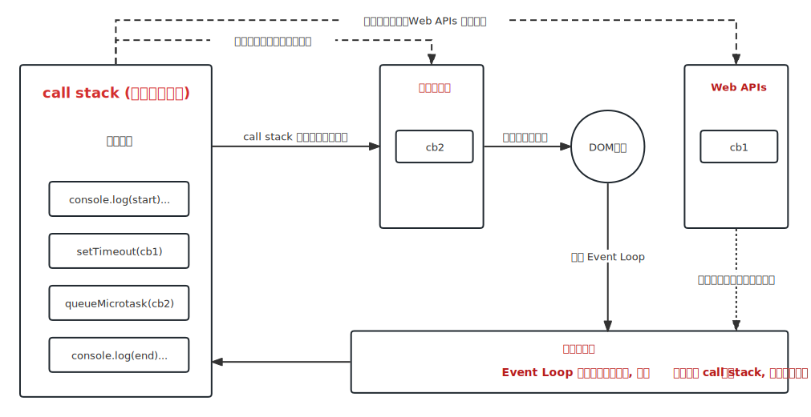

# Event Loop 机制

> 只涉及浏览器环境下的事件循环机制, Node 环境不一样。

## 背景

总所周知, JavaScript 诞生起就是一门**单线程非阻塞**的脚本语言。这是由其最初的用途来决定的: 与浏览器交互。

单线程意味着, JavaScript 代码在执行的任何时候, 都只有一个主线程来处理所有任务。比如 DOM 渲染和脚本执行就是共用一个线程。

而非阻塞则是当代码需要进行一项异步任务(无法立刻返回结果, 需要花一定时间才能返回的任务, 如 Ajax 事件)的时候，主线程会先挂起这个任务，然后在异步任务返回结果的时候再根据一定规则去执行相应的回调。

首先需要明确的是, 异步是基于回调实现的, 而 <f>event loop 就是回调的实现原理</f>。

:::tip 补充
DOM 事件也使用回调, 同样基于 event loop。
:::

:::info JS 如何执行

1. 从前往后, 一行一行执行
2. 如果某一行执行出错, 则停止下面代码的执行
3. 先执行完同步代码, 再执行异步回调

:::

## 宏任务与微任务

在介绍 event loop 机制之前, 还需要明确宏任务与微任务的一些相关概念。

由于异步任务之间并不相同，因此它们执行的优先级也有区别。不同的异步任务被分为两类:

- 宏任务(macro task)
- 微任务(micro task)

宏任务是由浏览器规定的, 而微任务是 ECMAScript 语法制定。宏任务在 DOM 渲染后触发, 微任务在 DOM 渲染前触发。

:::danger 重要

- 宏任务 : setTimeout、setInterval、Ajax、requestAnimationFrame、DOM 事件等
- 微任务: Promise.then、Promise.catch、Promise.finally、MutationObserver、queueMicrotask、process.nextTick(Node 独有)

:::

## event loop

event loop(事件循环/事件轮询)是回调实现的原理, 所有需要基于回调实现的都是基于 event loop 机制。

1. 清空函数调用堆栈。至此, 同步代码执行完毕
   - 遇到微任务回调推入微任务队列
   - 遇到宏任务回调挂起, 等待时机, 时机成熟推入宏任务队列
2. 清空微任务队列
3. 渲染 DOM
4. 不停轮询宏任务队列, 直至宏任务队列含有队头, 单个将队头推入函数调用堆栈
5. 回到第一步, 不断重复整个流程

:::warning 注意
宏任务推入函数调用堆栈都是**单个**的, 可以理解为一个宏任务就有一个循环流程。
:::

:::info 补充

- 大部分资料没有宏任务队列, 而是 call queue, 可看作相同
- event loop 只是轮询宏任务, 上一阶段的微任务已执行完毕

:::
