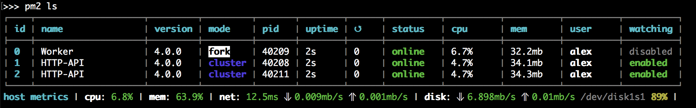

# PM2 基础使用

[PM2](https://pm2.keymetrics.io/docs/usage/quick-start/) 是 node 的进程管理工具, 可以利用它来简化很多 node 应用管理的繁琐任务。如性能监控、自动重启、负载均衡等, 而且使用非常简单。

## 安装

```shell
npm install pm2 -g
```

## 常用命令

### 启动项目

```shell
pm2 start app.js
```

### 重启项目

```shell
pm2 restart app.js
```

### 项目列表

```shell
pm2 list | ls | status
```



### 停止项目

:::code-group

```shell [全部停止]
pm2 stop all
```

```shell [停止特定项目]
# 需要先通过 pm2 list 获取应用的名字(--name指定的)或者进程 id
pm2 stop app_name | app_id
```

:::

### 从项目列表删除项目

:::code-group

```shell [全部删除]
pm2 delete all
```

```shell [删除特定项目]
# 需要先通过 pm2 list 获取应用的名字(--name指定的)或者进程 id
pm2 delete app_name | app_id
```

:::

### 查看日志

```shell
pm2 logs
```

### 查看某个进程信息

```shell
pm2 describe app_id
```

> pm2 还可以负载均衡, 项目开机自启动, 部署项目等作用, 用到再说。
