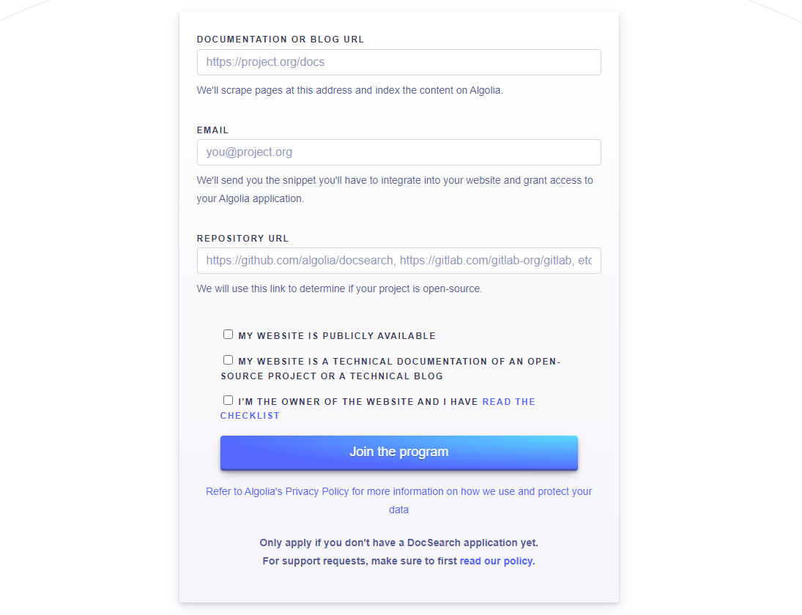
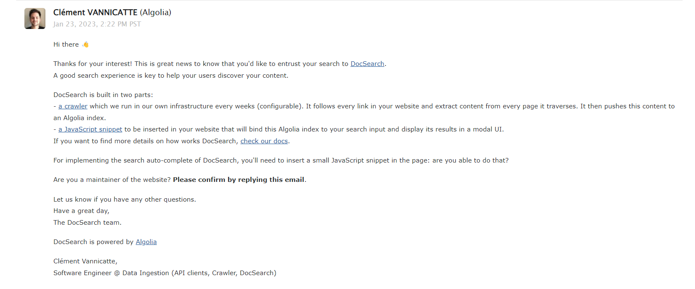
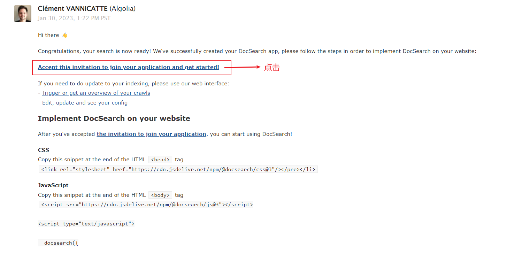
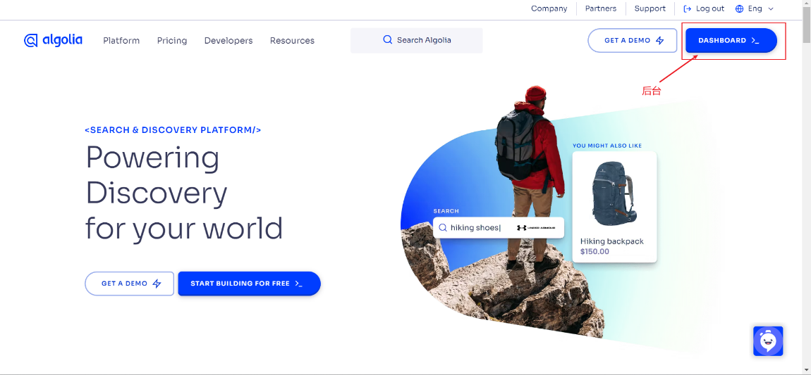
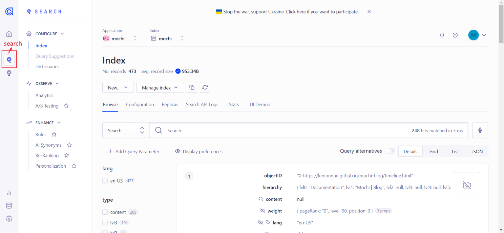
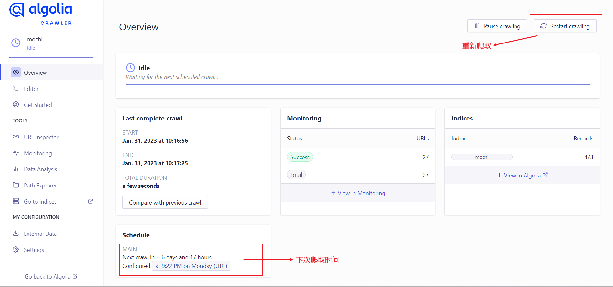

# Algolia DocSearch

[Algolia DocSearch](https://docsearch.algolia.com/) 是 Algolia 提供的自动化的全文搜索服务, 且其服务能以 API 的形式方便地布局到网页、客户端、APP 等多种场景。

## 申请 Algolia DocSearch 服务

> 诸如 Vue 官网文档也是集成它。

### 使用要求

Algolia DocSearch 提供的免费服务是需要申请的, 当网站满足下列条件时，Algolia 工作人员才可能让我们的申请通过:

- 网站必须**公开**
- 网站内容必须是**开源项目的技术文档或技术博客**
- 申请者为网站**所有者**

:::warning 注意
Algolia DocSearch 的申请流程着实有点慢, 请耐心等待。
:::

### 申请流程

1. 前往 [Algolia DocSearch Apply](https://docsearch.algolia.com/apply/) 填写申请信息
   
2. 在申请一段时间后, Algolia 会发来一封邮件, 需要及时回复
   
   :::tip 回复话术
   Thanks!
   I am the maintatiner of the website, I can modify the code.
   :::
3. 再等待一段时间后, 就会收到一封包含 appId 的邮件, 即表示申请成功
   
4. 点击接受邀请链接, 重新设置密码, 登录 Algolia

## 启动搜索服务

> 这里只介绍 Vitepress 集成 Algolia DocSearch

### vitepress 集成

`themeConfig.algolia` 选项允许使用 Algolia DocSearch。要启用它，至少需要提供 appId、apiKey 和 indexName。

```js
module.exports = {
  themeConfig: {
    algolia: {
      appId: 'appId',
      apiKey: 'apiKey',
      indexName: 'indexName',
    },
  },
}
```

有关更多选项, 可以查看 [Algolia DocSearch‘s documentation](https://docsearch.algolia.com/docs/DocSearch-v3)。

将任何额外的选项与其他选项一起传递都是可行的, 比如 searchParameters:

```js
module.exports = {
  themeConfig: {
    algolia: {
      appId: 'appId',
      apiKey: 'apiKey',
      indexName: 'indexName',
      searchParameters: {
        facetFilters: ['tags:guide,api'],
      },
    },
  },
}
```

## Algolia 控制台

登录 [Algolia](https://www.algolia.com/), 点击 Dashboard 进入后台。



### 仪表盘

点击 search 选项可以查看相应的 Records。



### 爬虫控制台

[爬虫控制台](https://crawler.algolia.com/admin/)可以手动爬取数据或更改爬取设置等。



默认是爬取间隔时间为一周, 好像也设置不了, 手动爬取还是很有必要的。
