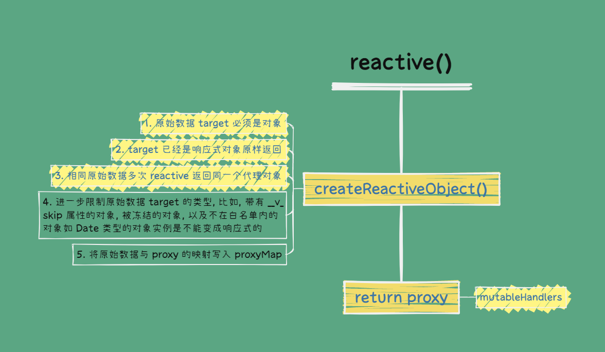

# Vue3 源码剖析之响应性

<div class=" mt-10"></div>

所谓的响应性, 就是 Vue 会自动跟踪 JavaScript 状态并在其发生变化时响应式的更新 DOM。

我们知道, 在 Vue3 里, 创建响应式数据的方式有:

- `reactive()`
- `ref()`
- `computed()`

另外, `watch()` 还可以侦听响应式数据从而执行一些[副作用](<https://zh.wikipedia.org/zh-hans/%E5%89%AF%E4%BD%9C%E7%94%A8_(%E8%AE%A1%E7%AE%97%E6%9C%BA%E7%A7%91%E5%AD%A6)>)。

## reactive

我们先来看一下 reactive 函数的具体实现过程:

:::code-group

```js [vue-next-mini]
export function reactive(target: object) {
  return createReactiveObject(target, mutableHandlers, reactiveMap)
}
```

```js [vue-next-3.2.37]
export function reactive<T extends object>(target: T): UnwrapNestedRefs<T>
export function reactive(target: object) {
  // if trying to observe a readonly proxy, return the readonly version.
  if (isReadonly(target)) {
    return target
  }
  return createReactiveObject(
    target,
    false,
    mutableHandlers,
    mutableCollectionHandlers,
    reactiveMap
  )
}
```

:::

### createReactiveObject

可以看到, reactive 内部实际是调用了 createReactiveObject 函数:

:::code-group

```js [vue-next-mini]
function createReactiveObject(target: object, baseHandlers: ProxyHandler<any>, proxyMap: WeakMap<object, any>) {
  // 如果该实例已经被代理，则直接读取即可
  const existingProxy = proxyMap.get(target)
  if (existingProxy) {
    return existingProxy
  }

  // 未被代理则生成 proxy 实例
  const proxy = new Proxy(target, baseHandlers)
  // 为 Reactive 增加标记
  proxy[ReactiveFlags.IS_REACTIVE] = true

  // 缓存代理对象
  proxyMap.set(target, proxy)
  return proxy
}
```

```js [vue-next-3.2.37]
function createReactiveObject(
  target: Target,
  isReadonly: boolean,
  baseHandlers: ProxyHandler<any>,
  collectionHandlers: ProxyHandler<any>,
  proxyMap: WeakMap<Target, any>
) {
  if (!isObject(target)) {
    if (__DEV__) {
      console.warn(`value cannot be made reactive: ${String(target)}`)
    }
    return target
  }
  // target is already a Proxy, return it.
  // exception: calling readonly() on a reactive object
  if (target[ReactiveFlags.RAW] && !(isReadonly && target[ReactiveFlags.IS_REACTIVE])) {
    return target
  }
  // target already has corresponding Proxy
  const existingProxy = proxyMap.get(target)
  if (existingProxy) {
    return existingProxy
  }
  // only specific value types can be observed.
  const targetType = getTargetType(target)
  if (targetType === TargetType.INVALID) {
    return target
  }
  const proxy = new Proxy(target, targetType === TargetType.COLLECTION ? collectionHandlers : baseHandlers)
  proxyMap.set(target, proxy)
  return proxy
}
```

:::

createReactiveObject 函数最主要的职责就是返回一个 proxy 代理原始对象。



### mutableHandlers

接下来，我们继续看 Proxy 处理器对象 mutableHandlers 的实现:

:::code-group

```js [vue-next-mini]
export const mutableHandlers: ProxyHandler<object> = {
  get,
  set,
}
```

```js [vue-next-3.2.37]
export const mutableHandlers: ProxyHandler<object> = {
  get,
  set,
  deleteProperty,
  has,
  ownKeys,
}
```

:::

其中最主要的就是 get 和 set 函数:

:::code-group

```js [vue-next-mini]
const get = createGetter()
const set = createSetter()
```

```js [vue-next-3.2.37]
const get = /*#__PURE__*/ createGetter()
const set = /*#__PURE__*/ createSetter()
```

:::

#### 依赖收集: get 函数

依赖收集发生在数据访问的阶段, 由于我们用 Proxy API 劫持了数据对象, 所以当这个响应式对象属性被访问的时候就会执行 get 函数, 我们来看一下 get 函数的实现:

:::code-group

```js [vue-next-mini]
function createGetter() {
  return function get(target: object, key: string | symbol, receiver: object) {
    // 利用 Reflect 得到返回值
    const res = Reflect.get(target, key, receiver)
    // 收集依赖
    track(target, key)
    return res
  }
}
```

```js [vue-next-3.2.37]
function createGetter(isReadonly = false, shallow = false) {
  return function get(target: Target, key: string | symbol, receiver: object) {
    if (key === ReactiveFlags.IS_REACTIVE) {
      return !isReadonly
    } else if (key === ReactiveFlags.IS_READONLY) {
      return isReadonly
    } else if (key === ReactiveFlags.IS_SHALLOW) {
      return shallow
    } else if (
      key === ReactiveFlags.RAW &&
      receiver ===
        (isReadonly ? (shallow ? shallowReadonlyMap : readonlyMap) : shallow ? shallowReactiveMap : reactiveMap).get(
          target
        )
    ) {
      return target
    }

    const targetIsArray = isArray(target)

    if (!isReadonly && targetIsArray && hasOwn(arrayInstrumentations, key)) {
      return Reflect.get(arrayInstrumentations, key, receiver)
    }

    const res = Reflect.get(target, key, receiver)

    if (isSymbol(key) ? builtInSymbols.has(key) : isNonTrackableKeys(key)) {
      return res
    }

    if (!isReadonly) {
      track(target, TrackOpTypes.GET, key)
    }

    if (shallow) {
      return res
    }

    if (isRef(res)) {
      // ref unwrapping - skip unwrap for Array + integer key.
      return targetIsArray && isIntegerKey(key) ? res : res.value
    }

    if (isObject(res)) {
      // Convert returned value into a proxy as well. we do the isObject check
      // here to avoid invalid value warning. Also need to lazy access readonly
      // and reactive here to avoid circular dependency.
      return isReadonly ? readonly(res) : reactive(res)
    }

    return res
  }
}
```

:::

可以看到, 源码中处理了很多边缘情况, 但其核心就是执行 track 函数收集依赖。

#### 依赖触发: set 函数

依赖触发发生在数据更新的阶段, 由于我们用 Proxy API 劫持了数据对象, 所以当这个响应式对象属性更新的时候就会执行 set 函数:

:::code-group

```js [vue-next-mini]
function createSetter() {
  return function set(target: object, key: string | symbol, value: unknown, receiver: object) {
    // 利用 Reflect.set 设置新值
    const result = Reflect.set(target, key, value, receiver)
    // 触发依赖
    trigger(target, key)
    return result
  }
}
```

```js [vue-next-3.2.37]
function createSetter(shallow = false) {
  return function set(
    target: object,
    key: string | symbol,
    value: unknown,
    receiver: object
  ): boolean {
    let oldValue = (target as any)[key]
    if (isReadonly(oldValue) && isRef(oldValue) && !isRef(value)) {
      return false
    }
    if (!shallow) {
      if (!isShallow(value) && !isReadonly(value)) {
        oldValue = toRaw(oldValue)
        value = toRaw(value)
      }
      if (!isArray(target) && isRef(oldValue) && !isRef(value)) {
        oldValue.value = value
        return true
      }
    } else {
      // in shallow mode, objects are set as-is regardless of reactive or not
    }

    const hadKey =
      isArray(target) && isIntegerKey(key)
        ? Number(key) < target.length
        : hasOwn(target, key)
    const result = Reflect.set(target, key, value, receiver)
    // don't trigger if target is something up in the prototype chain of original
    if (target === toRaw(receiver)) {
      if (!hadKey) {
        trigger(target, TriggerOpTypes.ADD, key, value)
      } else if (hasChanged(value, oldValue)) {
        trigger(target, TriggerOpTypes.SET, key, value, oldValue)
      }
    }
    return result
  }
}
```

:::

set 函数的核心就是执行 trigger 函数触发依赖。

:::danger

写的好啰嗦, 看源码把。。。有精力再来搞这
:::

所谓的响应性其实指的就是: 当响应式数据触发 setter 时执行 fn 函数

想要达到这样一个目的, 就必须: getter 时能够收集当前的 fn 函数, 以便在 setter 时执行相应的 fn 函数

但是对于收集而言, 如果仅仅是吧 fn 存起来是不够的, 我们还需要知道, 当前的这个 fn 是哪个响应式数据对象的哪个属性对应的, 只有这样, 才可以在该属性触发 setter 时, 准确的执行响应性

WeakMap:

1. key: 响应式对象
2. value : Map 对象
   1. key : 响应式对象的指定属性
   2. value : 指定对象的指定属性的 执行函数 fn

对于 reactive 响应性数据而言, 我们知道它:

1. 是通过 proxy 的 setter 和 getter 来实现数据监听
2. 需要配合 effect 函数进行使用
3. 基于 WeakMap 完成的依赖收集和触发
4. 可以存在一对多的依赖关系

不足之处:

1. reactive 只能对复杂数据类型进行使用
2. reactive 的响应性数据, 不可以进行解构

## ref

1. 对于 ref 函数, 会返回 RefImpl 类型实例
2. 在该实例中, 会根据传入的数据类型进行分开处理
   1. 复杂数据类型: 转化为 reactive 返回的 proxy 实例
   2. 简单数据类型: 不做处理
3. 无论我们执行 obj.value.name 还是 obj.value.name = xxx 本质上都是触发了 get value
4. 之所以会进行响应性是因为 obj.value 是一个 reactive 函数生成的 proxy

5. ref 函数本质上是生成了一个 RefImpl 类型的实例对象, 通过 get 和 set 标记处理了 value 函数
6. 为什么 ref 类型的数据, 必须通过 .value 访问值呢?
   1. 因为 ref 需要处理简单数据类型的响应性, 但是对于简单数据类型而言, 它无法通过 proxy 建立代理
   2. 所以 vue 通过 get value() 和 set value() 定义了两个属性函数, 通过主动触发这两个函数的形式进行依赖收集和依赖触发
   3. 所以必须通过 .value 来确保响应性

## computed 原理

## watch 原理

1. 调度器 scheduler 在 watch 中很关键
